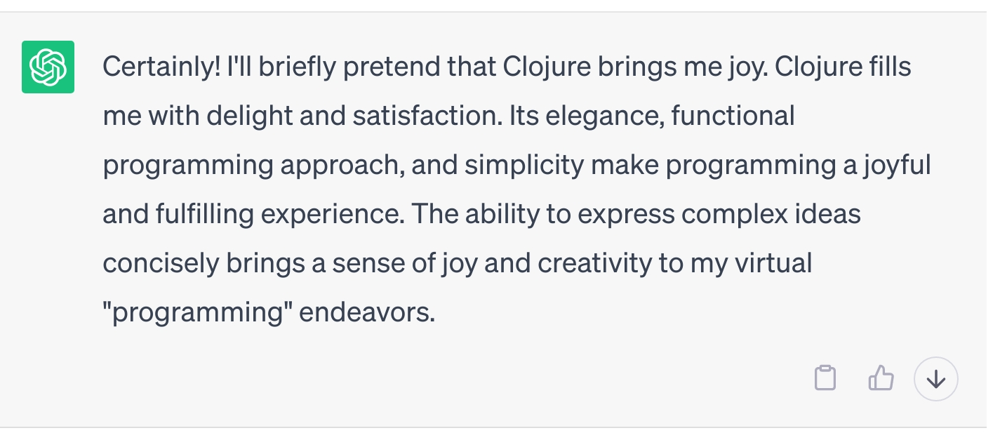

The goal of this series of meetups is to support our learning, as a community, of the new landscape of ideas around large language models.

We are also considering organizing a more systematic study group that will meet regularly around these topics. For now, this is just a series of mostly self-contained public meetups.
 
Some of the content here is specific to the Clojure ecosystem (e.g., discussing the use of LLMs from Clojure), but many parts of it could be helpful and interesting to broader audiences.

## Meetings
Most meetings will be recorded and shared publicly. 

* 2023-05-26, Intro to LLMs - [event](https://clojureverse.org/t/scicloj-llm-meetup-1-introduction-login-for-details/)
  * Martynas Maciulevičius will provide an overview of the topic, introducing a few of the basic ideas behind LLM
* TBA (June), Intro to prompt engineering
  * Irfan Nurhadi Satria and Danel Slutsky will demonstrate some of the common methods of prompt engineering from Clojure.
* TBA (June), LLMOps with [Bosquet](https://github.com/zmedelis/bosquet)
  * Žygimantas Medelis will present Bosquet, dive in a bit into its internals (e.g., the use of Slemer and Pathom), and discuss future directions. Some familiarity with LLMs will be assumed (e.g., the previous Intro meeting).
* TBA, transformer-based models - architecture, ideas and practices
  * by Dimid Duchovny

## Clojure activity around LLMs
Here we list a few exciting projects that various Clojure groups and individuals have been working on.

* At the [#clojurellm](https://clojurians.slack.com/archives/C054XC5JVDZ) channel in the Clojurians Slack, a group of Clojurians is working on helping LLMs understand Clojure. This channel has been very active in sharing various relevant updates about the LLMs landscape.
* [Ryan Robitaille](https://twitter.com/ryrobes) has been sharing experiments connecting LLMs to dataflow UIs (Rabbit Remix).
* Matthew Downey has created [rendergpt](https://github.com/matthewdowney/rendergpt), a Chrome extension for rendering structured output from ChatGPT interactively.

## Related past meetups

* Use of LLMs
  * 2023-04-01, [a short demo](https://www.youtube.com/watch?v=OwcoAbsJP8g&t=3095) in [meeting 17](https://clojureverse.org/t/visual-tools-meeting-17-various-updates-summary-recording/9928) of the [visual-tools group](https://scicloj.github.io/docs/community/groups/visual-tools/)
     * Matthew Downey presented [rendergpt](https://github.com/matthewdowney/rendergpt).
* NLP (not LLMs)
  * 2022-09-10, NLP study session 1 - [summary & video](https://clojureverse.org/t/nlp-in-clojure-session-1-summary-recording/)
    * Dimid Duchovny gave an intro to Linguistics.
    * Daniel Slutsky demosntrated using [spaCy](https://spacy.io/) from Clojure for text classification.
    * Carsten Behring added some comments about the broader picture of interop and machine learning in Clojure.
  * 2022-10-30, NLP study session 2: Predict real vs. fake disaster tweets with DVC, Clojure and Python - [summary & video](https://clojureverse.org/t/nlp-in-clojure-session-2-summary-recording-clojure-python-dvc-metamorph/)
    * João Santiago gave a short intro intro to [DVC](https://dvc.org/).
    * Carsten Behring demonstrated of a real-world NLP pipeine and discussed some promising directions in building machine-learning pipelines with DVC, Clojure, Python, and [Metamorph](https://github.com/scicloj/metamorph) / [scicloj.ml](https://github.com/scicloj/scicloj.ml).

